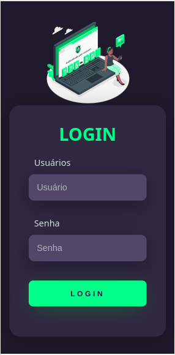

<h1 align="center">Tela de Login</h1>

Tela de Login responsiva usando HTML5 e CSS3 (puro)

Sumário
=================
<!--ts-->
   * [Status](#status)
   * [Tecnologias Usadas](#tecnologias)
   * [Versão Desktop](#desktop)
   * [Versão Mobile](#mobile)
<!--te-->

Status
=================
<h4 align="center"> 
	Em construção...  🚧
</h4>

Tecnologias Usadas
=================
As seguintes ferramentas foram usadas na construção do projeto:

- [HTML5]
- [CSS3]

Versão Desktop
=================
<h1 align="center">
  
</h1>

Versão Mobile
=================
<h1 align="center">
  
</h1>

